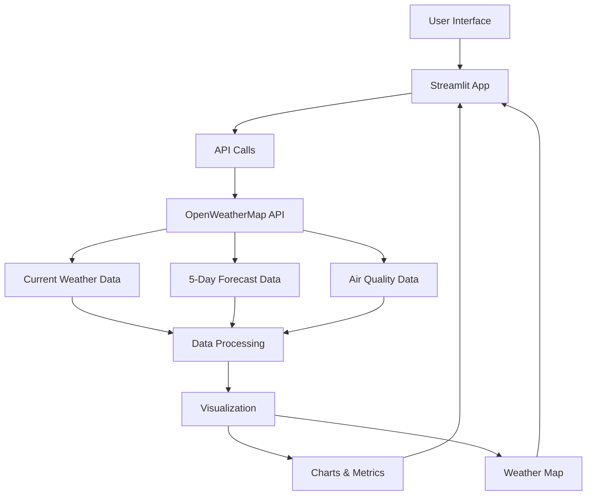

# 🌦️ Advanced Weather Forecast App

A comprehensive weather application that provides current weather conditions, 5-day forecasts, air quality data, and interactive weather maps for any location worldwide.


## Features

- 🌡️ Current weather conditions with temperature, humidity, wind speed  
- 📅 5-day forecast with hourly breakdowns  
- 🌬️ Air Quality Index (AQI) with health recommendations  
- 🌍 Interactive weather map  
- 📱 Location detection (with user permission)  
- 📊 Visual charts for temperature trends  
- ☀️ UV index recommendations  
- 🎨 Responsive design with beautiful UI  

## Project Structure Diagram



## Code Explanation

### Main Components

**Core Functions**:

- `get_weather()`: Fetches current weather data  
- `get_forecast()`: Retrieves 5-day forecast  
- `get_air_quality()`: Gets AQI data  
- `display_weather()`: Renders main weather dashboard  
- `display_forecast()`: Shows forecast charts and cards  
- `display_air_quality()`: Presents AQI information  

**UI Components**:

- Custom CSS styling for responsive design  
- Interactive input field with location detection  
- Weather condition cards with emoji visuals  
- Plotly charts for temperature trends  
- Embedded weather map iframe  

**Data Flow**:

User Input → API Request → Data Processing → Visualization → User Output

## Key Technologies

- Python 3 (Streamlit, Pandas, Plotly)  
- OpenWeatherMap API (free tier)  
- CSS for custom styling  
- Mermaid.js for documentation diagrams  

## Installation

Clone the repository:

```bash
git clone https://github.com/muzaffar401/Weather_Forcast_App.git
cd Weather_Forcast_App
```

Install dependencies:

```bash
pip install -r requirements.txt
```

Set up your OpenWeatherMap API key:

```bash
export OPENWEATHER_API_KEY='your_api_key_here'
```

Run the app:

```bash
streamlit run main.py
```

## Configuration

Create a `.env` file for environment variables:

```env
OPENWEATHER_API_KEY=your_api_key_here
```

## How to Use

- Enter a city name in the search box  
- Or click "Use My Location" (requires browser permission)  
- View current weather metrics  
- Explore the 5-day forecast tabs  
- Check air quality information  
- Interact with the global weather map  

## API Reference

This app uses the OpenWeatherMap API:

- Current Weather Data (free tier)  
- 5 Day / 3 Hour Forecast  
- Air Pollution API  

## Future Enhancements

- Add historical weather data  
- Implement weather alerts  
- Add multi-language support  
- Include more visualization types  
- Dark/light mode toggle  

## Contributing

Pull requests are welcome! For major changes, please open an issue first.

## License

MIT
